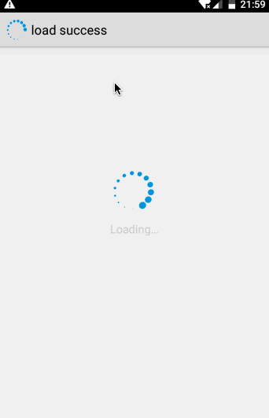
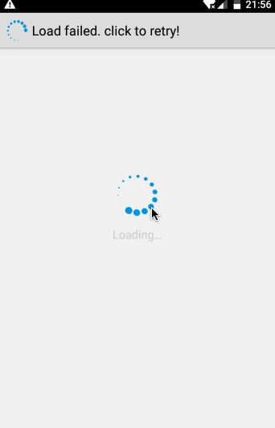
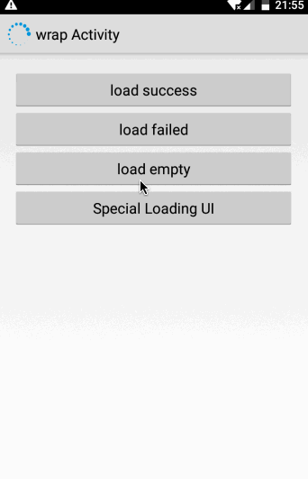
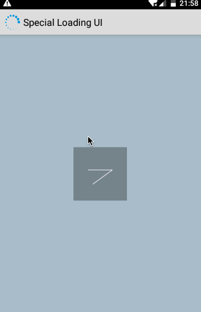
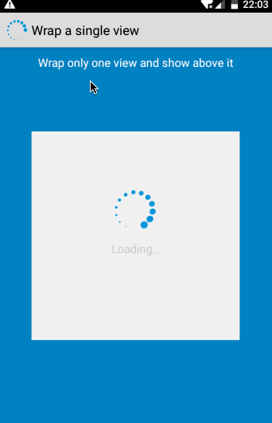
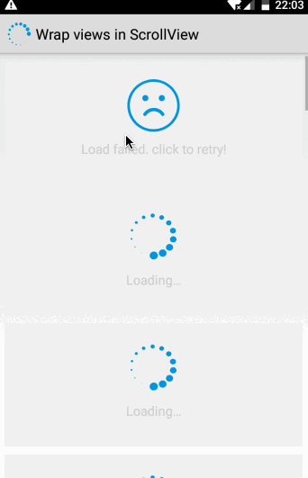
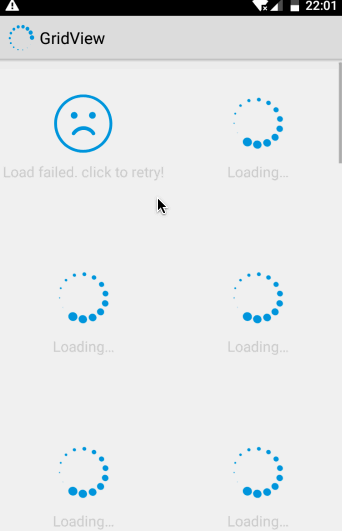
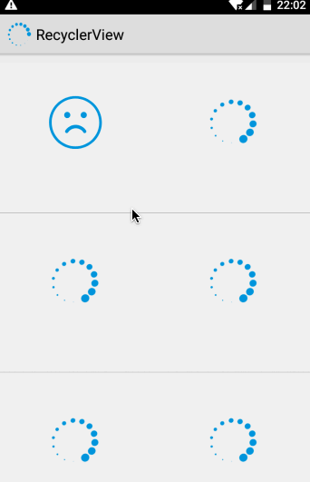

# Gloading

[JavaDocs](https://luckybilly.github.io/Gloading/) | [Demo下载](https://github.com/luckybilly/Gloading/raw/master/demo.apk)

最新版本: [](https://bintray.com/hellobilly/android/gloading/_latestVersion)

- 深度解耦Android App中全局加载中、加载失败及空数据视图，为组件化改造过程中的解耦长征助力
- 分离全局加载状态视图的实现和使用
- 不需要在每个页面的布局文件中额外添加加载状态视图
- 可用于Activity、Fragment，也可用于为某个View显示加载状态，还可用于各种通过列表Item（ListView、RecyclerView等）
- 轻量级：只有一个java文件，没有任何其它依赖，不到300行，其中注释占100+行，aar仅6K
- 兼容性好：
    - android系统版本从api 1开始兼容
    - 兼容绝大多数第三方炫酷的LoadingView（在Adapter中将其作为View提供给Gloading）

## 演示

为Activity添加加载状态

加载成功|加载失败<br>点击重试|加载成功<br>无数据|个别页面使用特殊的Loading视图
:---:|:---:|:---:|:---:
|||

为View添加加载状态

单个View|多个View|用于GridView|用于RecyclerView<br>并且不显示文字
:---:|:---:|:---:|:---:
|||


## 背景

Loading动画几乎每个Android App中都有。

一般在需要用户等待的场景，显示一个Loading动画可以让用户知道App正在加载数据，而不是程序卡死，从而给用户较好的使用体验。

同样的道理，当加载的数据为空时显示一个数据为空的视图、在数据加载失败时显示加载失败对应的UI并支持点击重试会比白屏的用户体验更好一些。

加载中、加载失败、空数据的UI风格，一般来说在App内的所有页面中需要保持一致，也就是需要做到全局统一。

#### 传统的做法

1. 定义一个(或多个)显示不同加载状态的控件或者xml布局文件（例如：`LoadingView`）
2. 每个页面的布局中都写上这个view
3. 在`BaseActivity/BaseFragment`中封装`LoadingView`的初始化逻辑，并封装加载状态切换时的UI显示逻辑，暴露给子类以下方法：
	- `void showLoading();` //调用此方法显示加载中的动画
	- `void showLoadFailed();` //调用此方法显示加载失败界面
	- `void showEmpty();` //调用此方法显示空页面
	- `void onClickRetry();` //子类中实现，点击重试的回调方法
4. 在`BaseActivity/BaseFragment`的子类中可通过上一步的封装比较方便地使用加载状态显示功能

这种使用方式耦合度太高，每个页面的布局文件中都需要添加`LoadingView`，使用起来不方便而且维护成本较高，一旦UI设计师需要更改布局，修改起来成本较高。

#### 好一点的封装方法

1. 定义一个(或多个)显示不同加载状态的控件或者xml布局文件（例如：`LoadingView`）
2. 定义一个工具类(`LoadingUtil`)来管理`LoadingView`，不同状态显示不同的UI（或者在多个View之间切换显示）
3. 在`BaseActivity/BaseFragment`中对`LoadingUtil`的使用进行封装，暴露给子类以下方法：
	- `void showLoading();` //调用此方法显示加载中的动画
	- `void showLoadFailed();` //调用此方法显示加载失败界面
	- `void showEmpty();` //调用此方法显示空页面
	- `void onClickRetry();` //子类中实现，点击重试的回调方法
	- <font color=red>`abstract int getContainerId();` //子类中实现，`LoadingUtil`动态创建`LoadingView`并添加到该方法返回id对应的控件中</font>
4. 在`BaseActivity/BaseFragment`的子类中可通过上一步的封装比较方便地使用加载状态显示功能

这种封装的好处是通过封装动态地创建`LoadingView`并添加到指定的父容器中，让具体页面无需关注`LoadingView`的实现，只需要指定在哪个容器中显示即可，很大程度地进行了解耦。如果公司只在一个App中使用，这基本上就够了。

但是，这种封装方式还是存在耦合：页面与它所使用的`LoadingView`仍然存在绑定关系。如果需要复用到其它App中，因为每个App的UI风格可能不同，对应的`LoadingView`布局也可能会不一样，要想复用必须先将页面与`LoadingView`解耦。

## 如何解耦？

#### 梳理一下我们需要实现的效果
- 页面的`LoadingView`可切换，且不需要改动页面代码
- 页面中可指定`LoadingView`的显示区域（例如导航栏Title不希望被`LoadingView`覆盖）
- 支持在Fragment中使用
- 支持加载失败页面中点击重试
- 兼容不同页面显示的UI有细微差别（例如提示文字可能不同）

#### 2. 确定思路
说到View的解耦，很容易联想到Android系统中的AdapterView（我们常用的GridView和ListView都是它的子类）及support包里提供的ViewPager、RecyclerView等，它们都是通过Adapter来解耦的，将自身的逻辑与需要动态变化的子View进行分离。我们也可以按照这个思路来解耦`LoadingView`。

## 使用Gloading来解耦

[Gloading](https://github.com/luckybilly/Gloading)是一个基于Adapter思路实现的深度解耦App中全局LoadingView的轻量级工具(只有一个java文件，不到300行，其中注释占100+行，aar仅6K)

1、 依赖Gloading

```groovy
compile 'com.billy.android:gloading:1.0.0'
```
2、 创建`Adapter`，在`getView`方法中实现创建各种状态视图（加载中、加载失败、空数据等）的逻辑

Gloading不侵入UI布局，完全由用户自定义

```java
public class GlobalAdapter implements Gloading.Adapter {
    @Override
    public View getView(Gloading.Holder holder, View convertView, int status) {
        GlobalLoadingStatusView loadingStatusView = null;
        //convertView为可重用的布局
        //Holder中缓存了各状态下对应的View
        //	如果status对应的View为null，则convertView为上一个状态的View
        //	如果上一个状态的View也为null，则convertView为null
        if (convertView != null && convertView instanceof GlobalLoadingStatusView) {
            loadingStatusView = (GlobalLoadingStatusView) convertView;
        }
        if (loadingStatusView == null) {
            loadingStatusView = new GlobalLoadingStatusView(holder.getContext(), holder.getRetryTask());
        }
        loadingStatusView.setStatus(status);
        return loadingStatusView;
    }
    
    class GlobalLoadingStatusView extends RelativeLayout {

        public GlobalLoadingStatusView(Context context, Runnable retryTask) {
            super(context);
            //初始化LoadingView
            //如果需要支持点击重试，在适当的时机给对应的控件添加点击事件
        }
        
        public void setStatus(int status) {
            //设置当前的加载状态：加载中、加载失败、空数据等
            //其中，加载失败可判断当前是否联网，可现实无网络的状态
            //		属于加载失败状态下的一个分支,可自行决定是否实现
        }
    }
}
```
3、 初始化`Gloading`的默认`Adapter`

```java
Gloading.initDefault(new GlobalAdapter());
```

__注：可以用[AutoRegister](https://github.com/luckybilly/AutoRegister)在Gloading类装载进虚拟机时自动完成初始化注册，无需在app层执行注册，耦合度更低__

4、在需要使用`LoadingView`的地方获取`Holder`

```java
//在Activity中显示, 父容器为: android.R.id.content
Gloading.Holder holder = Gloading.getDefault().wrap(activity);

//需要支持加载失败后点击重试
Gloading.Holder holder = Gloading.getDefault().wrap(activity).withRetry(retryTask);
```

or

```java
//为某个View显示加载状态
//Gloading会自动创建一个FrameLayout，将view包裹起来，LoadingView也显示在其中
Gloading.Holder holder = Gloading.getDefault().wrap(view);

//需要支持加载失败后点击重试
Gloading.Holder holder = Gloading.getDefault().wrap(view).withRetry(retryTask);
```

5、 使用`Holder`来显示各种加载状态

```java
//显示加载中的状态，通常是显示一个加载动画
holder.showLoading() 

//显示加载成功状态（一般是隐藏LoadingView）
holder.showLoadSuccess()

//显示加载失败状态
holder.showFailed()

//数据加载完成，但数据为空
holder.showEmpty()

//如果以上默认提供的状态不能满足使用，可使用此方法调用其它状态
holder.showLoadingStatus(status)
```

更多API详情请查看 [Gloading JavaDocs](https://luckybilly.github.io/Gloading/)

6、 兼容多App场景下的页面、View的复用

每个App的`LoadingView`可能会不同，只需为每个App提供不同的`Adapter`，不同App调用不同的`Gloading.initDefault(new GlobalAdapter());`，具体页面中的使用代码无需改动。

注：如果使用[AutoRegister](https://github.com/luckybilly/AutoRegister)，则只需在不同App中创建各自的	`Adapter`实现类即可，无需手动注册。


## 开启/关闭Debug模式

```java
//设置为true时Logcat会输出日志
Gloading.debug(trueOrFalse);
```

## 鸣谢

Demo中的卡通图片均来自: https://www.thiswaifudoesnotexist.net/